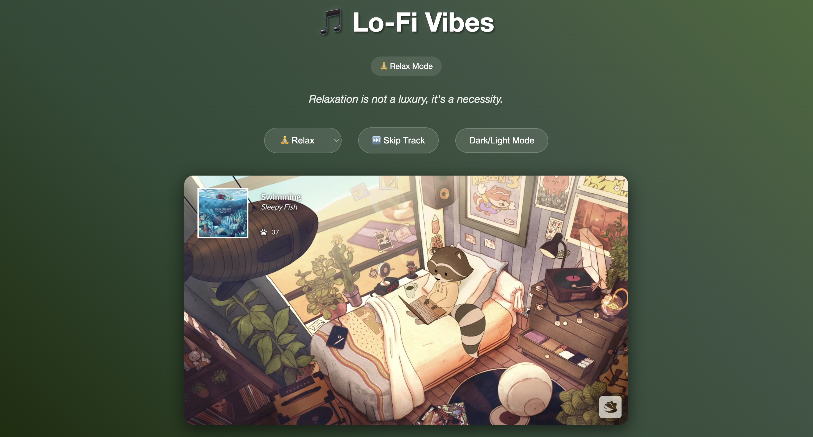
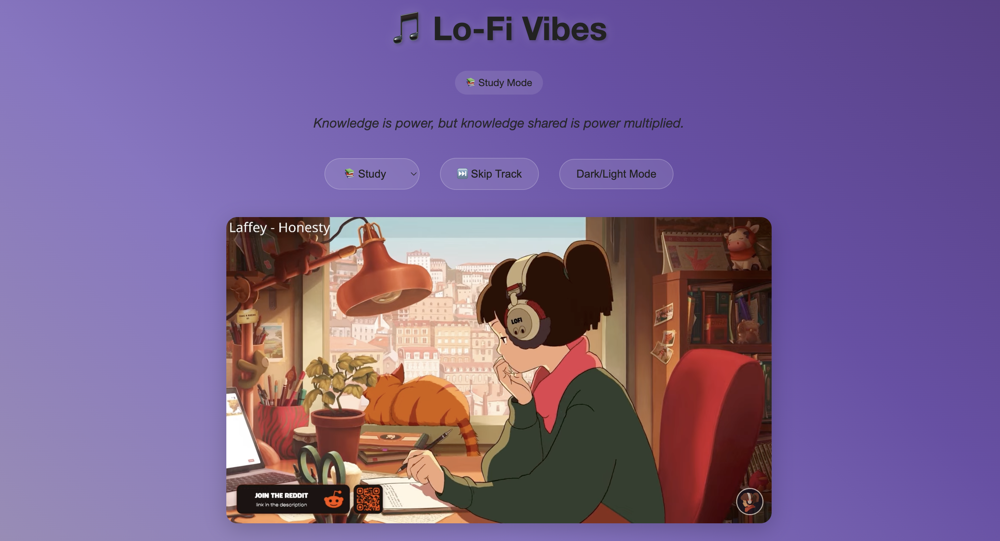

# 🎧 LofiToffee — Your Personal Lo-Fi Mood Station



**LofiToffee** is a minimalist web app that lets you **vibe to lo-fi beats**, match your music to your **mood**, and enjoy calming **quotes** — all in a beautifully animated, theme-switchable interface.

Whether you’re **studying**, **relaxing**, **focusing**, or just **chilling**, LofiToffee brings you the perfect lo-fi soundtrack and ambient experience to help you stay grounded.

---

## 🚀 Features

- 🎵 Mood-based **Lo-fi YouTube tracks**
- 🌙 **Dark / Light mode** toggle
- ⏭ **Skip button** to change music anytime
- 🧘 **Mood-based quotes** to match the vibe
- 🎨 **Animated gradient background**
- 💾 **LocalStorage** remembers your last mood & theme

---

## 💻 Screenshots

### 🖼 Light Mode — Study Vibes


### 🌙 Dark Mode Toggle


### 🧘 Chill Mood — Different Track


---

## 🔧 How to Run Locally

```bash
# 1. Clone the Repository
git clone https://github.com/your-username/lofitoffee.git
cd lofitoffee

# 2. Install Dependencies
npm install

# 3. Start the Server
node server.js

# 4. Open in Browser
http://localhost:3000
